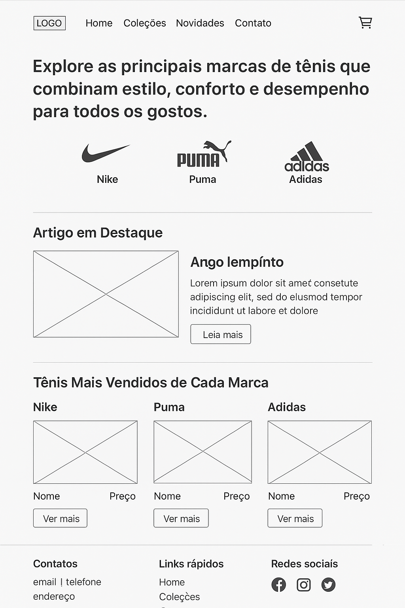

# Trabalho Prático - Semana 03

Dessa vez, vamos escolher uma proposta de projeto para trabalhar.

Nessa atividade, você deverá montar a página inicial do projeto escolhido, a organização do HTML aplicando semântica correta e uso aprimorado do CSS. Leia o enunciado completo no Canvas para mais detalhes.

**IMPORTANTE:** Você deve trabalhar e alterar apenas arquivos dentro da pasta **`public`**. Deixe todos os demais arquivos e pastas desse repositório inalterados. **PRESTE MUITA ATENÇÃO NISSO.**

## Informações Gerais

- Nome: Gustavo Henrique de Lima

- Matricula: 899524

- Proposta de projeto escolhida: A minha escolha de projeto foi um blog informativo sobre tênis

- Breve descrição sobre seu projeto:
  A ideia do meu projetpo foi criar um BLOG informativo sobre tênis, falando sobre marcas, modelos de tênis, e também um artigo falando sobre sneaker e sneakerhead.

## Print do(s) wireframe(s) criado

## Print da home-page criada

<< COLOQUE A IMAGEM AQUI >>
